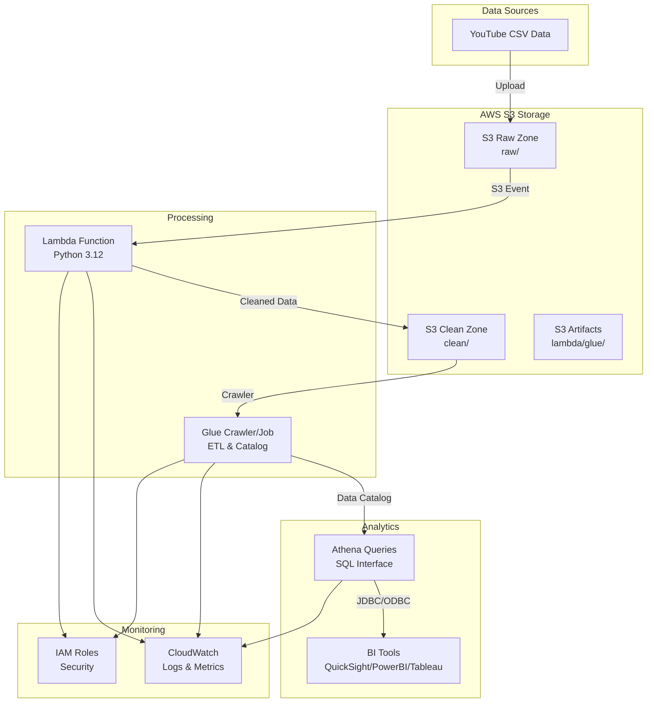

# YouTube Trending Data ETL on AWS (Serverless)

> **TL;DR**: Serverless ETL pipeline processing YouTube trending data through S3 → Lambda → Glue → Athena → BI tools. Deploy with CloudFormation, monitor with CloudWatch.

## 🏗️ Architecture

### High-Level Flow


**📊 [View Full Architecture Diagram](docs/architecture/ARCHITECTURE.png)**

## 📁 Repository Structure

```
youtube-trending-etl-pipeline/
├── cloudformation/
│   └── s3-lambda-glue-athena.yaml    # Infrastructure as Code
├── lambda/
│   └── lambda_function.py             # Data cleaning Lambda
├── glue/
│   └── glue_job_etl.py               # ETL transformation script
├── athena/
│   ├── query1.sql                     # Sample analytics queries
│   ├── query2.sql
│   ├── query3.sql
│   ├── query4.sql
│   └── query5.sql
├── dataset/
│   └── USvideos.csv                   # Sample YouTube data
├── docs/
│   ├── architecture/
│   │   ├── ARCHITECTURE.png           # System architecture
│   │   └── Data-Flow.png             # Data flow diagram
│   └── assets/screenshots/            # Operation screenshots
└── README.md
```

## ⚡ Quick Start

### Prerequisites
- **AWS CLI v2** configured with appropriate permissions
- **Python 3.12** for local development
- **zip** utility for Lambda packaging
- **IAM permissions**: S3, Lambda, Glue, Athena, CloudWatch, IAM

### 1. Package & Upload Artifacts
```bash
# Package Lambda function
cd lambda && zip -r lambda_function.zip lambda_function.py && cd -

# Upload to artifacts bucket
aws s3 cp lambda/lambda_function.zip s3://<ARTIFACTS_BUCKET>/lambda/lambda_function.zip
aws s3 cp glue/glue_job_etl.py s3://<ARTIFACTS_BUCKET>/glue/glue_job_etl.py
```

### 2. Deploy Infrastructure
```bash
aws cloudformation deploy \
  --stack-name youtube-etl \
  --template-file cloudformation/s3-lambda-glue-athena.yaml \
  --capabilities CAPABILITY_NAMED_IAM \
  --parameter-overrides \
    ProjectName=youtube-trending-etl \
    RawBucketName=<RAW_BUCKET> \
    CleanBucketName=<CLEAN_BUCKET> \
    AthenaResultsBucketName=<ATHENA_RESULTS_BUCKET> \
    CodeBucketName=<ARTIFACTS_BUCKET> \
    LambdaCodeKey=lambda/lambda_function.zip \
    GlueScriptKey=glue/glue_job_etl.py
```

### 3. Test Data Flow
1. Upload CSV file to S3 `raw/` bucket
2. Lambda automatically triggers on S3 event
3. Check CloudWatch logs for processing status
4. Verify cleaned data in S3 `clean/` bucket

### 4. Query with Athena
1. Open **Athena Console** → Choose your **WorkGroup**
2. Select **Database**: `youtube_trending_db`
3. **Sample Query**:
```sql
SELECT 
    title,
    channel_title,
    view_count,
    likes,
    comment_count,
    published_at
FROM cleaned_youtube_data 
WHERE view_count > 1000000
ORDER BY view_count DESC
LIMIT 10;
```

## 🔌 BI Connection

### QuickSight
- **Data Source**: Athena
- **Connection**: Direct query or SPICE dataset

### Power BI
- **Data Source**: Amazon Athena (ODBC)
- **Driver**: Simba Athena ODBC Driver

### Tableau
- **Data Source**: Amazon Athena
- **Connection**: JDBC/ODBC with AWS credentials

## 📊 Screenshots Gallery

| Screenshot | Description |
|------------|-------------|
|  | Lambda function configuration and monitoring |
|  | Glue job execution and monitoring dashboard |
|  | Optimized data storage in Parquet format |
|  | SQL query interface and execution |
|  | Query results and data preview |
|  | Processed and cleaned YouTube data |
|  | Glue crawler configuration for clean data |
|  | Lambda function execution logs |
|  | Clean zone processing logs |

## 🚀 Operations & Cost Optimization

### Monitoring
- **CloudWatch Logs**: Lambda, Glue, and Athena execution logs
- **CloudWatch Metrics**: S3, Lambda, and Glue performance metrics
- **S3 Analytics**: Storage usage and access patterns

### Cost Optimization
- **S3 Lifecycle**: Move old data to IA/Glacier
- **Data Compression**: Parquet format for analytics
- **Partitioning**: Time-based partitioning for efficient queries
- **Lambda Timeout**: Optimize function execution time

### Best Practices
- Use S3 Intelligent Tiering for cost-effective storage
- Implement proper error handling and retry logic
- Monitor CloudWatch metrics for performance bottlenecks
- Regular cleanup of temporary files and logs

## 🔒 Security

- **No secrets committed** to repository
- **IAM roles** with least privilege principle
- **S3 bucket policies** for secure access
- **VPC configuration** for private resources (if needed)
- **CloudTrail** for API call logging

## 📝 License

This project is licensed under the MIT License - see the [LICENSE](LICENSE) file for details.

## 🚀 Push to GitHub

```bash
# One-time init (if this is a fresh folder)
git init
git checkout -b main

# OPTIONAL: Git LFS for screenshots (skip if you don't need it)
# brew install git-lfs  # macOS (or see https://git-lfs.com for other OS)
# git lfs install
# git lfs track "docs/assets/screenshots/*" "docs/architecture/*.png"
# git add .gitattributes

# Stage everything (code, docs, screenshots, diagram)
git add .

# Commit with a clear message
git commit -m "Docs: add README, screenshots gallery, architecture diagram; .gitignore"

# Set your remote and push
git remote add origin https://github.com/<YOUR_USERNAME>/<REPO_NAME>.git
git push -u origin main
```

---

**🎯 Ready to deploy?** Follow the Quick Start section above to get your ETL pipeline running on AWS! 