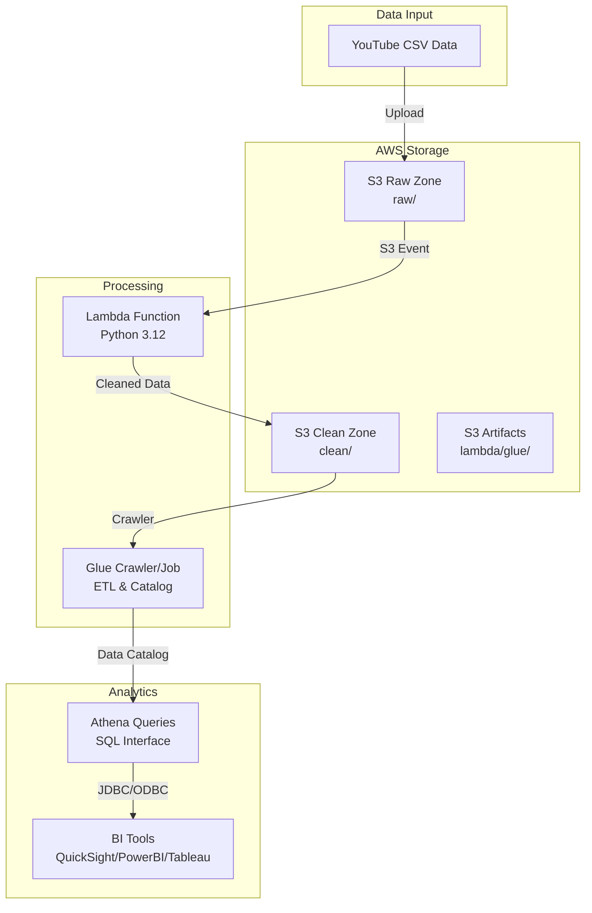
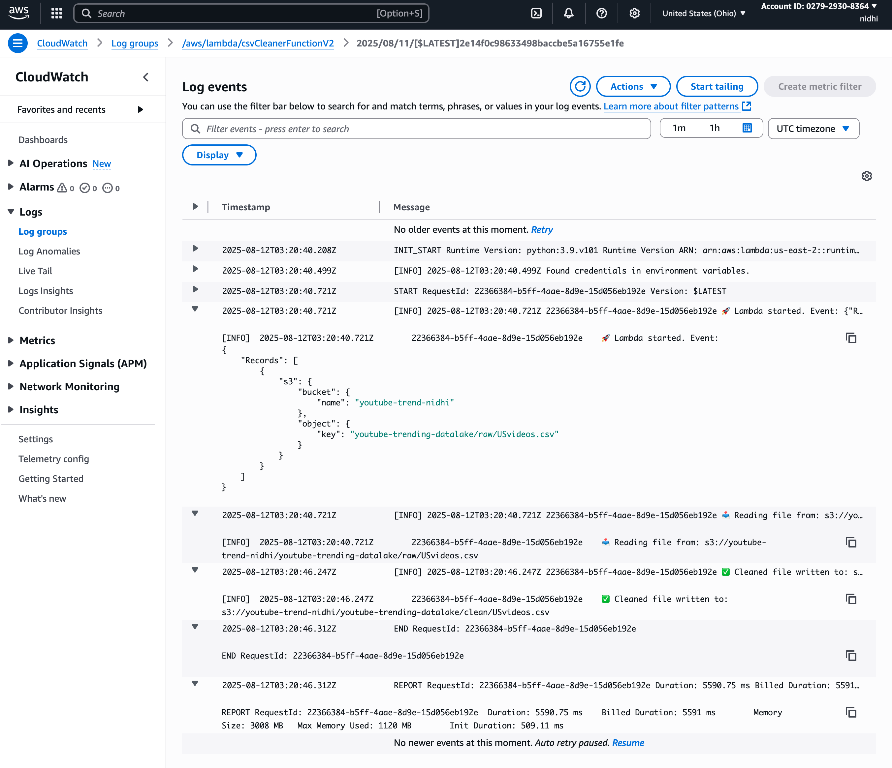
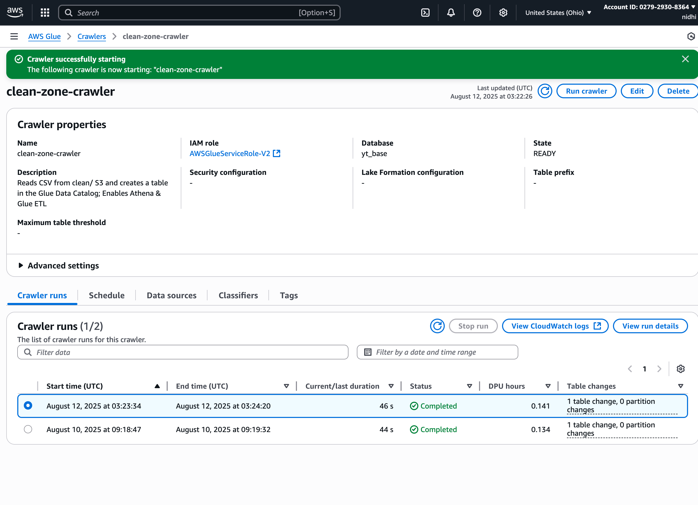
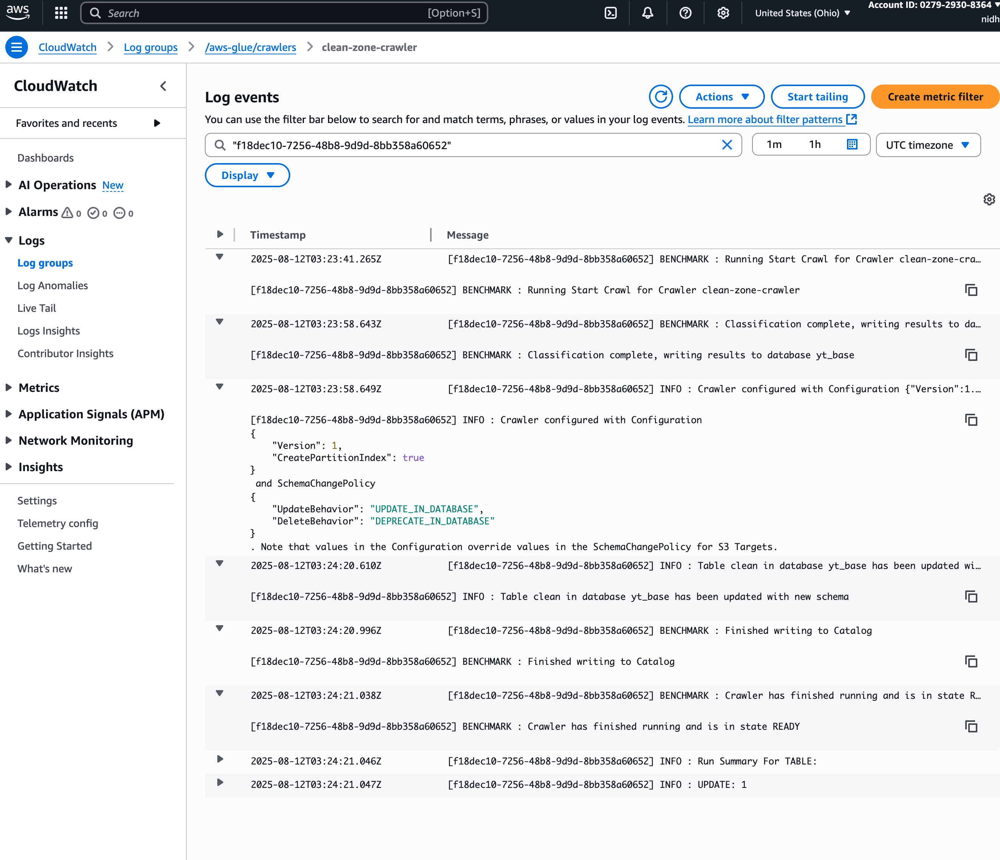
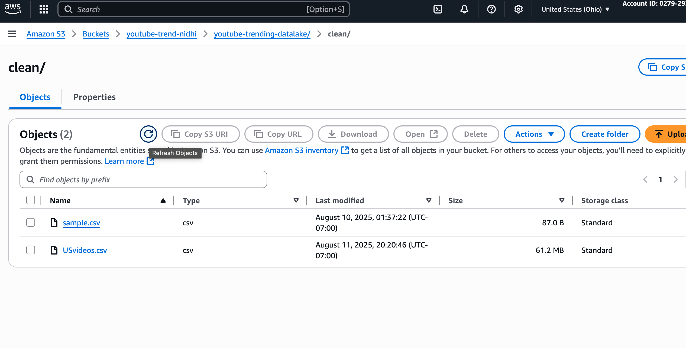
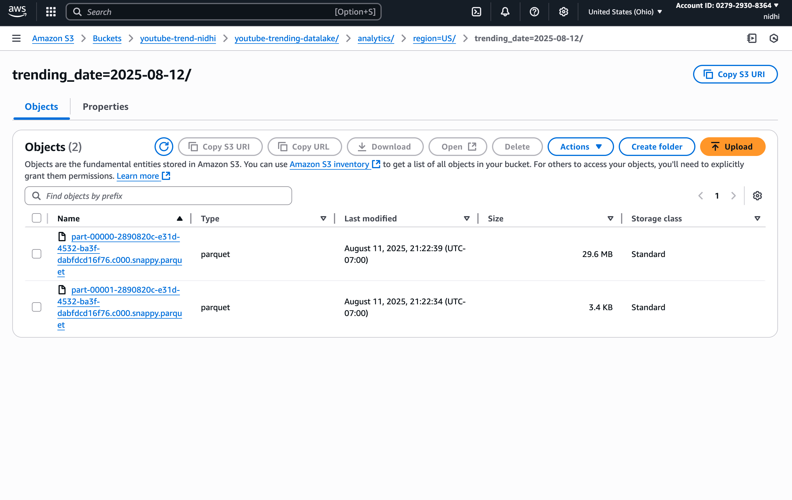
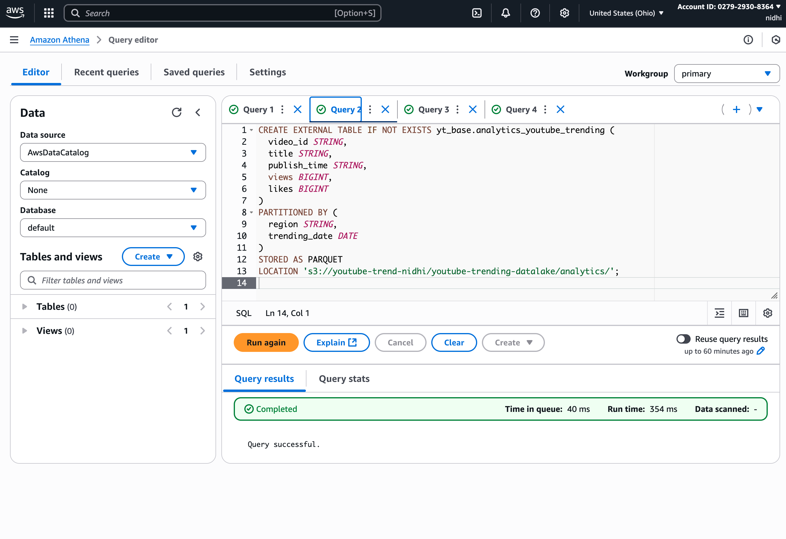
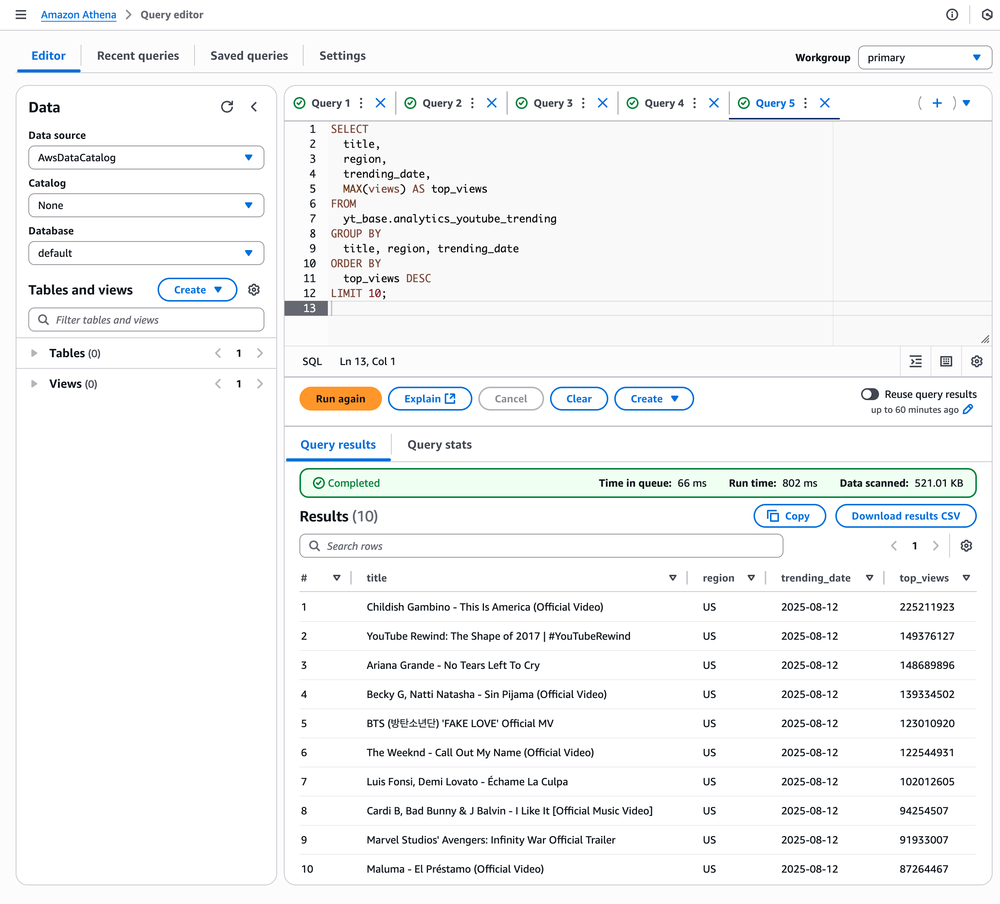

# YouTube Trending Data ETL on AWS

> **TL;DR**: Serverless ETL pipeline that processes YouTube trending data using AWS services. Upload CSV → S3 → Lambda → Glue → Athena → BI tools.

## 🏗️ Architecture

### System Overview


**📊 Architecture Diagrams:**
- [**System Architecture**](docs/architecture/ARCHITECTURE.png) - Complete system overview
- [**Data Flow**](docs/architecture/Data-Flow.png) - How data moves through the system

## 📁 Project Structure

```
youtube-trending-etl-pipeline/
├── cloudformation/
│   └── s3-lambda-glue-athena.yaml    # AWS infrastructure setup
├── lambda/
│   └── lambda_function.py             # Data cleaning function
├── glue/
│   └── glue_job_etl.py               # ETL transformation script
├── athena/
│   ├── query1.sql                     # Sample analytics queries
│   ├── query2.sql
│   ├── query3.sql
│   ├── query4.sql
│   └── query5.sql
├── dataset/
│   └── USvideos.csv                   # Sample YouTube data
├── docs/
│   ├── architecture/                   # System diagrams
│   └── assets/screenshots/            # Operation screenshots
└── README.md
```

## ⚡ Quick Start

### What You Need
- **AWS CLI v2** with proper permissions
- **Python 3.12** for local work
- **zip** tool for Lambda packaging

### 1. Package & Upload
```bash
# Create Lambda package
cd lambda && zip -r lambda_function.zip lambda_function.py && cd -

# Upload to S3
aws s3 cp lambda/lambda_function.zip s3://<ARTIFACTS_BUCKET>/lambda/lambda_function.zip
aws s3 cp glue/glue_job_etl.py s3://<ARTIFACTS_BUCKET>/glue/glue_job_etl.py
```

### 2. Deploy Infrastructure
```bash
aws cloudformation deploy \
  --stack-name youtube-etl \
  --template-file cloudformation/s3-lambda-glue-athena.yaml \
  --capabilities CAPABILITY_NAMED_IAM \
  --parameter-overrides \
    ProjectName=youtube-trending-etl \
    RawBucketName=<RAW_BUCKET> \
    CleanBucketName=<CLEAN_BUCKET> \
    AthenaResultsBucketName=<ATHENA_RESULTS_BUCKET> \
    CodeBucketName=<ARTIFACTS_BUCKET> \
    LambdaCodeKey=lambda/lambda_function.zip \
    GlueScriptKey=glue/glue_job_etl.py
```

### 3. Test the Pipeline
1. Upload a CSV file to S3 `raw/` bucket
2. Lambda automatically processes it
3. Check CloudWatch logs for status
4. View cleaned data in S3 `clean/` bucket

### 4. Query with Athena
1. Open **Athena Console** → Choose your **WorkGroup**
2. Select **Database**: `youtube_trending_db`
3. **Try this query**:
```sql
SELECT 
    title,
    channel_title,
    view_count,
    likes,
    comment_count,
    published_at
FROM cleaned_youtube_data 
WHERE view_count > 1000000
ORDER BY view_count DESC
LIMIT 10;
```

## 🔌 Connect to BI Tools

### QuickSight
- Connect directly to Athena
- Use SPICE for faster queries

### Power BI
- Use Athena ODBC driver
- Install Simba Athena ODBC Driver

### Tableau
- Connect via JDBC/ODBC
- Use AWS credentials

## 📊 Screenshots Gallery

### Lambda & Processing
| Screenshot | What It Shows |
|------------|---------------|
|  | Lambda function setup and monitoring |
|  | Lambda execution logs in CloudWatch |

### Glue ETL Process
| Screenshot | What It Shows |
|------------|---------------|
|  | Glue job execution dashboard |
|  | Glue crawler for clean data |
|  | Clean zone processing logs |

### Data & Results
| Screenshot | What It Shows |
|------------|---------------|
|  | Processed YouTube data |
|  | Data stored in Parquet format |

### Athena Queries
| Screenshot | What It Shows |
|------------|---------------|
|  | SQL query interface |
|  | Sample query results |

## 💡 Tips & Best Practices

### Cost Saving
- Use S3 Intelligent Tiering
- Compress data with Parquet format
- Set up S3 lifecycle rules

### Monitoring
- Check CloudWatch logs regularly
- Monitor Lambda execution time
- Track S3 storage usage

### Security
- Use IAM roles with minimal permissions
- Enable CloudTrail for audit logs
- Never commit secrets to code

## 🚀 Push to GitHub

```bash
# First time setup
git init
git checkout -b main

# Add all files
git add .

# Save your changes
git commit -m "Add YouTube ETL pipeline with docs and screenshots"

# Connect to GitHub and push
git remote add origin https://github.com/<YOUR_USERNAME>/<REPO_NAME>.git
git push -u origin main
```

---

**🎯 Ready to start?** Follow the Quick Start steps above to get your ETL pipeline running on AWS! 